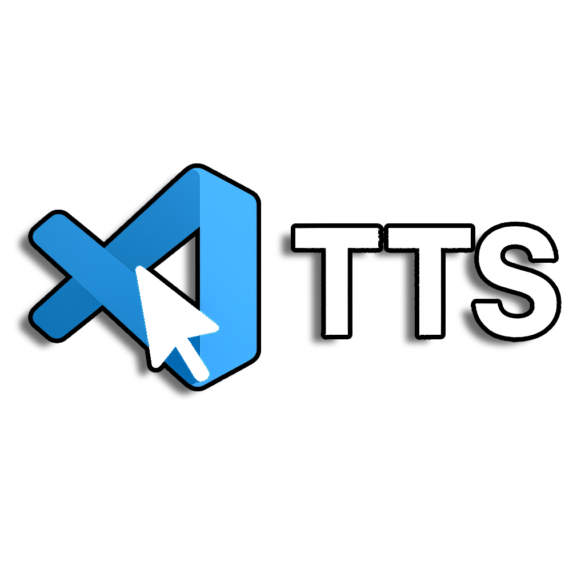

# Cursor Speech

A lightweight Text-to-Speech (TTS) extension for Visual Studio Code and Cursor AI. Select text in your editor or chat panel and have it read aloud using your system's built-in voice, boosting productivity and accessibility.

## Features

- **Offline TTS**: Uses your OS's native speech engine (e.g., SAPI on Windows, AVSpeechSynthesizer on macOS).
- **Speak Selected Text**: Right-click selected text in the editor and choose "Speak Text", or use the shortcut (Ctrl+Alt+S / Cmd+Alt+S).
- **Stop Speaking**: Use the "Stop Speaking" command or shortcut (Ctrl+Alt+X / Cmd+Alt+X).
- **Cursor AI Chat Support**: In the AI chat panel, select text and press the shortcut—it auto-copies to clipboard and speaks.
- **Configurable Speed**: Adjust speech rate in extension settings (default: 2.0).
- **No Setup Needed**: Install and go.

## Requirements

- VS Code or Cursor version 1.83.0 or higher.
- Windows, macOS, or Linux (TTS quality varies by OS; Linux may require additional setup like espeak).

## Installation

1. Visit the [Releases page](https://github.com/mem0cypher/CursorTTS/releases).
2. Download the latest `.vsix` file.
3. In VS Code/Cursor, open the Extensions view (Ctrl+Shift+X or Cmd+Shift+X).
4. Click the ... menu and select "Install from VSIX...".
5. Choose the downloaded file and restart if prompted.

Alternatively, build from source (see Contributing below).

## Usage

### In Code Editors or Files
1. Highlight text.
2. Right-click and select "Speak Text".

### In Cursor AI Chat Panel
1. Highlight text in the chat.
2. Press Ctrl+Alt+S (Cmd+Alt+S on Mac)—it copies and speaks automatically.

To stop speaking, use the "Stop Speaking" command from the command palette or press Ctrl+Alt+X (Cmd+Alt+X on Mac).

## Extension Settings

This extension contributes the following settings:

* `cursorSpeech.speed`: Set the speech speed multiplier (default: 2.0).

## Troubleshooting
- **No Sound?** Check your system's TTS settings (e.g., Windows Speech settings).
- **Shortcut Conflicts?** Customize via VS Code's Keyboard Shortcuts editor.
- **Chat Panel Issues?** Cursor's UI limits some features; the shortcut is our reliable workaround.

## Contributing

We welcome improvements!

1. Fork and clone: `git clone https://github.com/mem0cypher/CursorTTS.git`
2. Install deps: `yarn install`
3. Develop: Press F5 to test in a dev host window.
4. Package: `vsce package`
5. Submit a PR with your changes.

## License

This project is licensed under the MIT License - see the [LICENSE](LICENSE) file for details. 